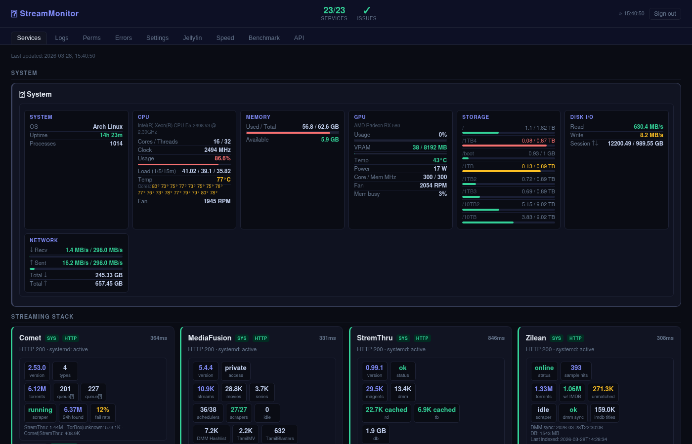
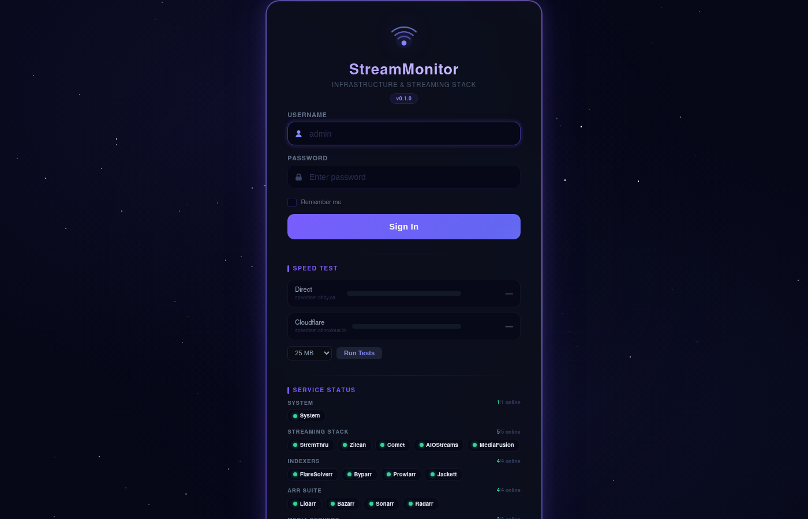
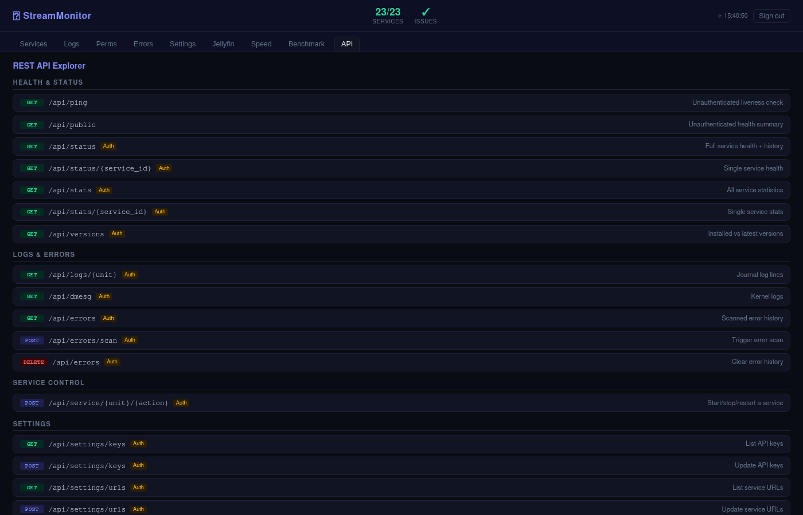

<div align="center">

# StreamMonitor

**Real-time infrastructure monitoring for self-hosted media streaming stacks**

[](https://github.com/obnoxiousmods/StreamMonitor/releases)
[](LICENSE)
[](https://python.org)
[](https://docs.astral.sh/ruff/)

Monitor, benchmark, and manage your entire debrid media stack from a single dark-themed dashboard.

</div>

---

## Screenshots

<details open>
<summary><b>Dashboard</b> — 23 services across 8 categories with SYS/HTTP badges, deep stats, and version tracking</summary>


</details>

<details>
<summary><b>Login</b> — Glassmorphism card with speed test, service status, animated starfield</summary>


</details>

<details>
<summary><b>API Explorer</b> — 24 interactive endpoints grouped by category with "Try it" buttons</summary>


</details>

---

## Features

### Dual Health Checks
- **systemd + HTTP** probing every 30 seconds with separate SYS/HTTP status badges
- **23 services** across 8 categories: Streaming, Indexers, Arr Suite, Media, Downloads, Infrastructure
- **120-entry** rolling history per service with latency tracking
- **Service controls** — start/stop/restart directly from the dashboard

### Deep Stats Collection
Per-service API collectors running every 60 seconds:

| Service | Highlights |
|---------|-----------|
| **Comet** | 6M+ torrents, scraper status, 24h found count, fail rate, top trackers |
| **MediaFusion** | 10K+ streams, 27 active scrapers, debrid cache, Redis/DB stats |
| **Zilean** | 1.3M torrents, IMDB match rate, quality distribution, DMM scraper |
| **StremThru** | 30K+ magnet cache, torrent info, DMM hashes |
| **AIOStreams** | Users, catalogs, presets, forced services, TMDB, build info |
| **Prowlarr** | Indexers, queries, grabs, health warnings |
| **Radarr/Sonarr/Lidarr** | Library sizes, queue, disk space, health checks |
| **Jellyfin/Plex** | Library counts, active sessions, now playing |

### System Monitoring
- **CPU** — model, cores, clock, usage with progress bar, load averages, temperatures (per-core via hwmon)
- **Memory** — used/total with progress bar, swap
- **GPU** — NVIDIA `nvidia-smi` full parse with device telemetry, encoder/decoder engines, per-process GPU memory and engine usage; AMD/Intel sysfs/fdinfo fallback
- **Storage** — per-mount disk usage with colored bars
- **Disk I/O** — read/write rates (whole-disk only, no partition double-counting)
- **Network** — recv/sent rates with link speed utilization, session totals
- **Processes** — top CPU and top RAM process lists with per-PID details

### Benchmark
Compare self-hosted vs public instances across 39 test titles (movies, TV, anime):
- **8 endpoints** tested with latency, stream count, resolution breakdown (4K/1080p/720p)
- **Run All** for aggregate comparison

### Speed Test
Built into the login page and standalone tab:
- **Direct vs Cloudflare** download comparison
- 10 MB to 500 MB test sizes, rate-limited (20/10min)

### More
- **Live Logs** — streaming journalctl with filtering
- **Error Scanner** — automated scanning with 20 service-specific classifiers
- **Permission Scanner** — scan and fix 94+ critical paths
- **Interactive API Explorer** — 24 endpoints with "Try it" buttons
- **Version Tracking** — installed vs latest GitHub release for 20+ services
- **Settings UI** — manage API keys, service URLs, and password from the dashboard

---

## Quick Start

### Binary (Linux x86_64)

```bash
wget https://github.com/obnoxiousmods/StreamMonitor/releases/latest/download/StreamMonitor.zip
unzip StreamMonitor.zip
cd StreamMonitor-*/
./streammonitor
# http://127.0.0.1:9090 — login: admin / admin
```

### From Source

```bash
git clone https://github.com/obnoxiousmods/StreamMonitor.git
cd StreamMonitor
cp .env.example .env  # Edit with your API keys and URLs
uv sync
npm ci
npm run build
uv run uvicorn app:app --host 127.0.0.1 --port 9090
```

### systemd Service

```ini
[Unit]
Description=StreamMonitor
After=network.target

[Service]
Type=simple
User=your-user
Group=media
WorkingDirectory=/path/to/StreamMonitor
ExecStart=uv run uvicorn app:app --host 127.0.0.1 --port 9090 --log-level info
Restart=on-failure
RestartSec=5

[Install]
WantedBy=multi-user.target
```

---

## Configuration

### `.env` File (Recommended)

Copy `.env.example` to `.env` and fill in your values. The file is auto-loaded at startup.

```bash
# API Keys
PROWLARR_API_KEY=your-key
RADARR_API_KEY=your-key
JELLYFIN_API_KEY=your-key

# Speed Test URLs
SPEEDTEST_DIRECT_URL=https://speedtest.example.com/speedtest/download
SPEEDTEST_CF_URL=https://speedtest-cf.example.com/speedtest/download

# Session Secret
MONITOR_SECRET=your-random-secret

# Optional: custom systemd unit names, or "none" for HTTP-only checks
JELLYFIN_UNIT=jellyfin-test
```

### Settings UI

API keys and service URLs can also be managed via the **Settings** tab in the dashboard. Changes are persisted to `data/apikeys.json` and `data/urls.json`.

### Adding Services

Edit `core/config.py`:

```python
SERVICES["myservice"] = {
    "name": "My Service",
    "unit": "myservice",                    # systemd unit, or None for HTTP-only
    "url": "http://127.0.0.1:PORT/health",  # health endpoint
    "ok": [200],                             # expected status codes
    "headers": {"X-Api-Key": MY_KEY},        # optional auth
    "category": "streaming",                 # UI grouping
}
```

---

## Architecture

```
streammonitor/
├── app.py                  # Starlette app, API routes, React SPA serving
├── main.py                 # Entry point (uvicorn)
├── core/                   # Core modules
│   ├── config.py           # Service definitions, .env loading, API keys
│   ├── auth.py             # Argon2id auth, session management
│   ├── health.py           # Dual health check loop (30s)
│   ├── errors.py           # Log scanner with 20 classifiers (120s)
│   ├── perms.py            # Permission scanner (94 paths)
│   └── logging_config.py   # Rotating file + colored console logging
├── routes/                 # API route handlers
│   ├── benchmark.py        # Stream resolution benchmark (39 titles)
│   ├── jellyfin.py         # Sessions and activity
│   ├── speedtest.py        # Speed test page + download endpoint
│   ├── public.py           # Unauthenticated health API
│   └── dmesg.py            # Kernel log endpoint
├── stats/                  # Background stats collection (60s)
│   ├── collectors.py       # 19 per-service API collectors
│   ├── system.py           # CPU, RAM, disk, GPU, network, temps
│   ├── gpu_nvidia.py       # Full nvidia-smi device/process parser
│   ├── process_metrics.py  # Shared top CPU/RAM process sampling
│   ├── github.py           # GitHub release version fetcher (6h)
│   └── base.py             # Shared httpx helpers
├── frontend/               # Vite + React + TypeScript dashboard source
├── static/app/             # Built React bundle served by Starlette
├── static/                 # Static runtime assets and legacy JS/CSS
└── .env                    # Configuration (gitignored)
```

---

## API

24 REST endpoints — see the interactive **API Explorer** tab in the dashboard, or [docs/API.md](docs/API.md).

| Category | Endpoints |
|----------|-----------|
| **Health** | `GET /api/ping`, `/api/public`, `/api/status[/{id}]` |
| **Stats** | `GET /api/stats[/{id}]`, `/api/versions` |
| **Logs** | `GET /api/logs/{unit}`, `/api/dmesg`, `/api/errors` |
| **Control** | `POST /api/service/{unit}/{action}`, `/api/errors/scan` |
| **Settings** | `GET/POST /api/settings/keys`, `/api/settings/urls`, `POST /api/settings/password` |
| **Tools** | `GET /api/benchmark`, `/api/jellyfin`, `/api/perms/scan` |
| **Speed Test** | `GET /speedtest`, `/speedtest/download?mb=25` |

---

## Development

### Linting

```bash
# Python
ruff check .          # Lint (zero ignored rules)
ruff format .         # Format

# JavaScript / CSS
npm run lint:js       # ESLint
npm run lint:css      # Stylelint
npm run format        # Prettier
```

### Building

```bash
uv pip install pyinstaller
uv run pyinstaller streammonitor.spec --noconfirm --clean
# Output: dist/streammonitor
```

---

## Stack Compatibility

| Category | Services |
|----------|----------|
| **Streaming** | Comet, MediaFusion, StremThru, Zilean, AIOStreams, MediaFlow Proxy |
| **Indexers** | Jackett, Prowlarr, FlareSolverr, Byparr |
| **Arr Suite** | Radarr, Sonarr, Lidarr, Bazarr |
| **Media** | Jellyfin, Plex, JellySeerr |
| **Downloads** | qBittorrent |
| **Infrastructure** | PostgreSQL, Redis/Valkey, PgBouncer |

---

## License

MIT
